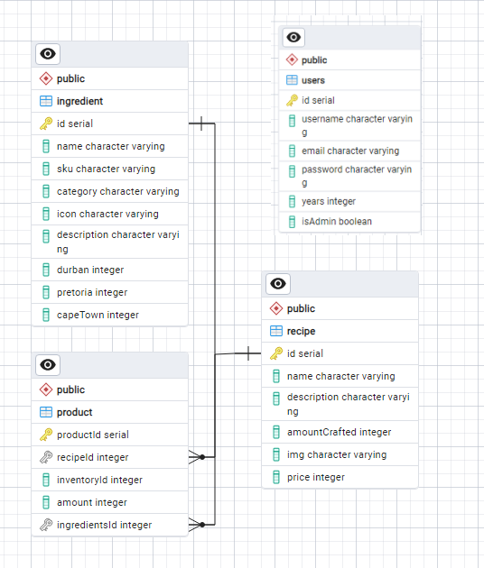

# Radian
<a name="readme-top"></a>
[![Contributors][contributors-shield]][contributors-url] 
[![Forks][forks]][forks-url]
[![Starsgazers][Stars]][Stars-url]
# 
<div align="center">
  <a href="https://github.com/LucaBreebaart/Radian_Backend">
    
  </a>

  <h3 align="center">Radian</h3>

  <p align="center">
    The all-in-one Online Inventory Tracking System
    <br />
    <a href="https://github.com/LucaBreebaart/Radian/tree/main/radian"><strong>Explore the files »</strong></a>
    <br />
    <br />
    <a href="add The demo Video Link here">View Demo</a>
    ·
    <a href="bug report link">Report Bug</a>
    ·
    <a href="Maybe">Request Feature</a>
  </p>
  <br />
</div>

## About this Project

Radian is a comprehensive application built with Angular for managing ingredient inventory across multiple locations. With these ingredients one is able to create recipes where they can further be used to craft products. With its intuitive interface and powerful features, Radian simplifies the process of tracking, editing, and updating ingredient and product information.

## Table of Contents

- [Built With](#built-with)
- [Installation](#installation-backend)

## Built With
* [![Angular][angular]][angular-url]
* [![Express][Express.js]][Express-url]
* [![PostgreSQL][postgresql]][postgresql-url]

<p align="right">(<a href="#readme-top">back to top</a>)</p>

## Installation Frontend

1. Clone the repo
   ```sh
   git clone https://github.com/LucaBreebaart/Radian.git
   ```
2. Re-direct to the correct file
   ```sh
   cd radian
   ```
3. Install packages with NPM
   ```sh
   npm i
   ```
   OR
   ```sh
   npm i --force
   ```
4. Start the Angular Application 
   ```sh
   ng serve
   ```
5. Open the App in your browser
   ```url
   http://localhost:4200/
   ```

<p align="right">(<a href="#readme-top">back to top</a>)</p>


## Installation Backend

1. Clone the repo
   ```sh
   git clone https://github.com/LucaBreebaart/Radian_Backend.git
   ```
2. Install NPM packages
   ```sh
   npm install
   ```
3. Start the backend server 
   ```sh
   npm run dev
   ```

<p align="right">(<a href="#readme-top">back to top</a>)</p>

## Features and Functionality

### Ingredient Management:

Radian provides a robust platform for managing ingredient inventory across multiple locations. Users can effortlessly track, edit, and update ingredient details, ensuring accurate and up-to-date information for crafting recipes and products.

### Product Crafting: 

Radian extends its functionality beyond ingredient management by enabling users to craft products using the created recipes. This feature enhances efficiency in production processes and ensures consistency in product quality.


### Admin Rights:

Radian incorporates robust admin rights management functionality to ensure effective platform governance and security. Leveraging Angular's routing and authentication mechanisms, the application employs a dedicated AuthGuard service to restrict access to certain routes based on user privileges.

### Security

Radian prioritizes user security by implementing robust password hashing techniques and integrating Google reCAPTCHA for enhanced authentication.

Password Hashing:

- Upon user registration or login, Radian securely hashes passwords using industry-standard algorithms, such as bcrypt, to prevent unauthorized access and safeguard user credentials.
The AuthService ensures that passwords are securely stored and transmitted, mitigating the risk of data breaches and unauthorized account access.

reCAPTCHA Integration:

- Radian utilizes the ng-recaptcha module to integrate Google reCAPTCHA into the login process, enhancing security and preventing automated bot attacks.

## Concept Process

The `Conceptual Process` is the set of actions, activities and research that was done when starting this project.

### Wireframes


### User flow and Sitemap breakdown and requirments


## Development Process

The `Development Process` is the technical implementations and functionality done in the frontend and backend of the application.

### Implementation Process
<!-- stipulate all of the functionality you included in the project -->


#### Highlights
<!-- stipulated the highlight you experienced with the project -->
* Sunshine.
* Rainbows.

#### Challenges
<!-- stipulated the challenges you faced with the project and why you think you faced it or how you think you'll solve it (if not solved) -->
* Bugs.
* Bugs.

### Future Implementation
<!-- stipulate functionality and improvements that can be implemented in the future. -->

* Future 1.
* Future 2.

## Final Outcome

### Mockups

### Video Demonstration

To see a run through of the application, click below:

[View Demonstration](path/to/video/demonstration)

<!-- ROADMAP -->

## Contributing

Contributions are what makes the open-source community such an amazing place to learn, inspire, and create. Any contributions you make are **greatly appreciated**.

1. Fork the Project
2. Create your Feature Branch (`git checkout -b feature/AmazingFeature`)
3. Commit your Changes (`git commit -m 'Add some AmazingFeature'`)
4. Push to the Branch (`git push origin feature/AmazingFeature`)
5. Open a Pull Request

<!-- AUTHORS -->
## Authors

[contributors-shield]: https://badgen.net/github/contributors/LucaBreebaart/Radian
[contributors-url]: https://github.com/LucaBreebaart/Radian/graphs/contributors
[forks]:https://badgen.net/github/forks/LucaBreebaart/Radian
[forks-url]: https://github.com/LucaBreebaart/Radian/forks
[Stars]: https://badgen.net/github/stars/LucaBreebaart/Radian
[Stars-url]: https://github.com/LucaBreebaart/Radian/stargazers
[angular]: https://img.shields.io/badge/Angular-DD0031?style=for-the-badge&logo=angular&logoColor=white
[angular-url]: https://angular.io/
[Express.js]: https://img.shields.io/badge/Express%20js-000000?style=for-the-badge&logo=express&logoColor=white
[Express-url]: https://expressjs.com/
[postgresql]: https://img.shields.io/badge/PostgreSQL-316192?style=for-the-badge&logo=postgresql&logoColor=white
[postgresql-url]: https://www.postgresql.org/
